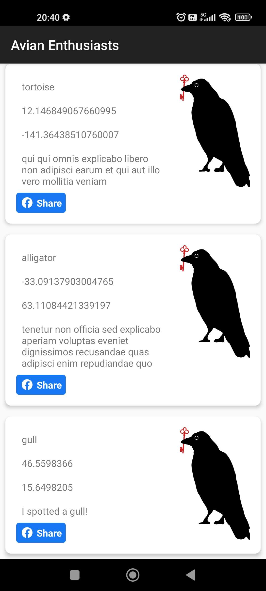
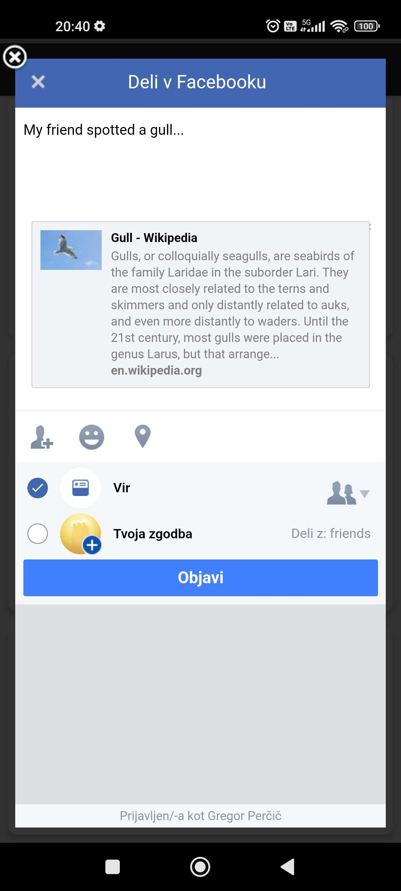

# AvianEnthusiasts

## Description

This application is diary for bird watchers. The user can input the name and description of a bird into a list, and can also append an image of the bird to them. The location of the sighted bird is saved automatically as the location of the mobile device at the time of the creation of the new input into the list. The app also provides a map displaying the locations of sighted birds.

## Technology used

This app is written in Kotlin in Android Studio.

## Additional technology — Facebook button integration with Facebook SDK for Android

### Why?

Facebook SDK for Android is used for:

- social integration: allows one to use Facebook (login, sharing content etc.) through one's own app,
- analytics: tracks user interactions within the app to gather insights and understand user behavior,
- Graph API Access: enables the app to retrieve and post data to Facebook, such as fetching user profiles, friends lists, and posting content.

### Pros and cons

Pros:

- easy Integration: simplifies the process of integrating Facebook features into Android apps,
- user engagement: enhances user engagement by leveraging Facebook's vast social network.

Cons:

- privacy concerns: given Facebook's history with user data, integrating their SDK may raise privacy concerns among users,
- **restricted functionality**: due to Facebook's new policy, features such as `setQuote` (which prefills the input field for a post with the data from one's app) do not function anymore; also, one can only append only one URL to their post.

### License

Facebook SDK for Android is published under [Facebook Platform License](https://developers.facebook.com/terms/).

### Number of users

Facebook has not publicly disclosed the number of the users of their SDK for Android, but it is reasonable to estimate that this number is in the millions.

### Project maintenance

Facebook has not disclosed the number of developers on this project. The last update to [the official GitHub repository for Facebook SDK for Android](https://github.com/facebook/facebook-android-sdk) has been made yesterday (18. 12. 2023); the repository also has 2865 commits, so it is reasonable to conclude that this project is very much alive.

### Installation and a simple use case

To set up integrated Facebook buttons in an Android app, one must follow these steps:

1. Add this dependency to `build.gradle.kts`:
```
implementation("com.facebook.android:facebook-android-sdk:[5,6)")
```
2. Add this line of code to `gradle.properties` (otherwise, conflicts between packages will arise):
```
android.enableJetifier=true
```
3. Obtain an application ID and put it in `AndroidManifest.xml`. For Facebook integration to work, one must first obtain an ID from Facebook (Meta). This is done by registering an account at [Meta for Developers](https://developers.facebook.com/) and then registering one's app in it, which generates its ID. Then, one includes the ID in the `application` tag in `AndroidManifest.xml` like so:
```
<meta-data android:name="com.facebook.sdk.ApplicationId"
    android:value="@string/facebook_app_id"/>
```

Now, we are ready to integrate a Facebook button.

For the layout, we can define a Facebook button like this:
```
<com.facebook.share.widget.ShareButton
    android:id="@+id/fb_share_button"
    android:layout_width="wrap_content"
    android:layout_height="wrap_content"/>
```

In the code of our activity, we have to configure its behavior:
```
val birdDetails = "Species: ${bird.species}\nComment: ${bird.comment}\nLatitude: ${bird.latitude}\nLongitude: ${bird.longitude}"

val shareButton = holder.itemView.findViewById<ShareButton>(R.id.fb_share_button)
val content = ShareLinkContent.Builder()
    .setContentUrl(Uri.parse("https://en.wikipedia.org/wiki/${bird.species}"))
    .setQuote(birdDetails)
    .build()
shareButton.shareContent = content
```
First, we locate the button by its ID. Then, we configure its behavior. With `setContentUrl`, we determine which URL will be appended to the new post. With `setQuote`, we determine which text will prefill the post input box. Lastly, with `shareButton.shareContent = content`, we assign the defined behavior to our button. In this case, the button will prefill the Facebook post box with the species and location of the sighted bird, and also the poster's comment about it, and also append a Wikipedia page about this bird to it.

We are ready to use it.

Say that a user spotted a gull. He inputs this into the app. Then, another user wants to post on their Facebook profile about the bird. They need only click the Facebook "Share" button in the bottom left corner of the item card.

<!--  -->


A Facebook prompt for publishing a new post pops up, with the appropriate URL appended (the text is not prefilled, because this functionality was dropped due to Facebook's new security policy). The user can now publish this specialized post.

<!--  -->


## Author

By Gregor Perčič.